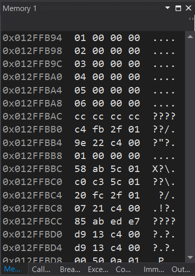

## 1. 배열의 개요

### 1.1 배열이란?
- **복합 데이터 타입**으로, 동일한 타입인 요소들의 집합이다.
- 개별 요소들에 직접 접근할 수 있어, 코드의 효율성을 높인다.

### 1.2 배열의 특징
1. **고정된 길이**: 배열은 선언 시 지정된 크기를 가지며 변경되지 않는다.
2. **연속된 메모리 주소**: 배열의 모든 요소가 연속적인 메모리 공간에 저장된다.
3. **인덱스 접근**: 인덱스를 사용하여 요소에 접근하며, 인덱스는 0부터 시작한다.
4. **범위 검사를 하지 않음**: 인덱스 범위(out-of-bound)에 대한 검사가 없다.
5. **초기화 필요**: 사용 전 초기화하는 것이 좋다.
6. **효율적인 데이터 구조**: 메모리 접근 속도가 빠르다.

```cpp
#include <iostream>

int main() {
    int scores[6] = { 1, 2, 3, 4, 5, 6 };
    return 0;
}
```

배열의 요소들이 연속적인 메모리 주소에 저장되어 있으며, 예를 들어 int형 배열은 각 요소가 4byte씩 차지한다.

{width=300px}

### 1.3 배열의 정의
```cpp
int scores[5];
```
- `int`는 배열 내 요소의 타입이며, `scores`는 배열의 이름, `[5]`는 요소의 개수를 의미한다.

### 1.4 배열의 초기화
```cpp
int scores[5] = {100, 85, 21, 56, 70};

int highscores[10] = {3, 5}; // 나머지 요소는 0으로 초기화

const int daysInYear = 365;
double temperature[daysInYear] = {0}; // 모든 요소를 0으로 초기화

int myArray[] = {1, 2, 3, 4, 5}; // 초기화 값으로 배열 크기를 자동 결정
```

### 1.5 배열에 접근
- 배열의 각 요소는 인덱스를 사용하여 읽거나 쓸 수 있다.
```cpp
#include <iostream>

int main() {
    int scores[] = {100, 85, 21, 56, 70};
    
    std::cout << "first score: " << scores[0] << std::endl;
    
    std::cin >> scores[0];  // 첫 번째 요소에 입력
    scores[1] = 40;         // 두 번째 요소 값 수정

    return 0;
}
```

--------------------------------------------------

## 2. 변수의 타입

### 2.1 Integer
- 정수를 표현한다.
{width=600px}

### 2.2 Floating Point
- 실수를 표현한다.
{width=600px}

### 2.3 Boolean
- true 또는 false를 표현한다.
{width=600px}

### 2.4 sizeof 연산자
- 타입이나 변수의 바이트 단위 크기를 반환한다.
```cpp
sizeof(int);          // int의 크기
sizeof(double);       // double의 크기
sizeof(favoriteNumber); // 변수의 크기
```

--------------------------------------------------

## 3. 상수

### 3.1 상수란?
- 변수와 유사하지만, 초기화 이후 변경할 수 없는 값이다.
- 사용 목적: **실수 방지** 및 프로그램의 견고함을 유지.
- 협업 시 중요한 역할을 한다.

### 3.2 상수의 종류
- **리터럴 상수:** 12, 3.14, "Minwon"
- **선언 상수:** `const int favoriteNumber = 18;`
- **상수 표현:** `constexpr int age = 20;`
- **열거형 (enum)**
- **정의 상수:** `#define pi 3.1415926`

--------------------------------------------------

## 참고 자료
이 문서 작성에는 [YouTube Playlist: C++ Programming][playlist]를 참고했습니다.

[playlist]: https://www.youtube.com/playlist?list=PLMcUoebWMS1nzhlx-NbD4KBGEP1UCUDF_
