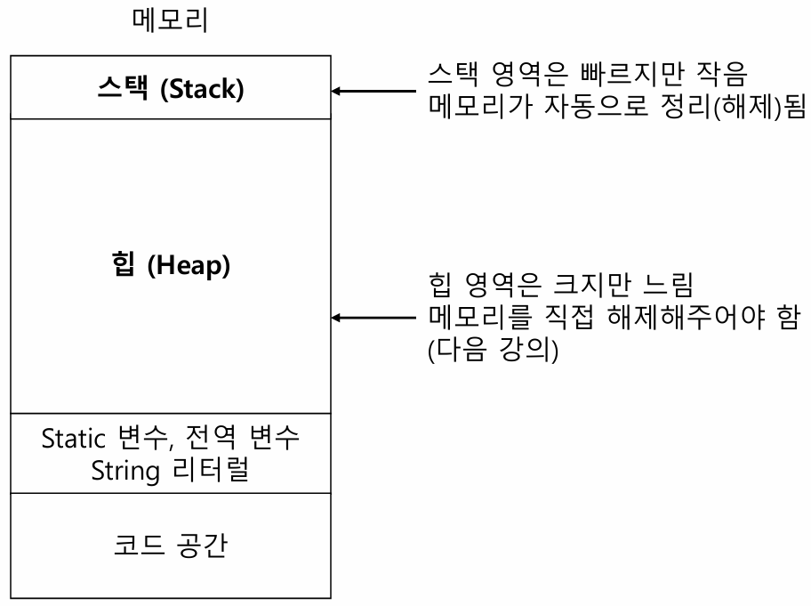
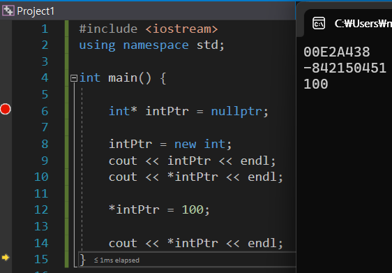
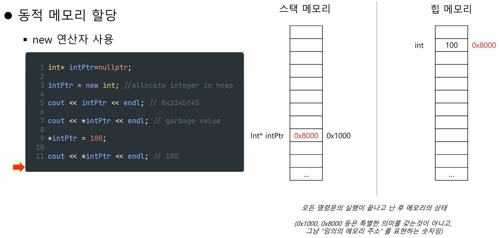
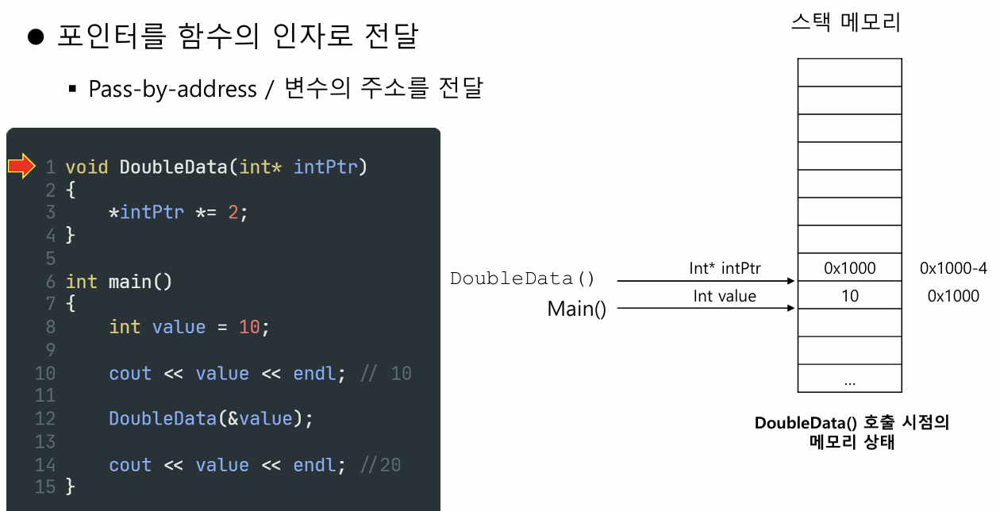
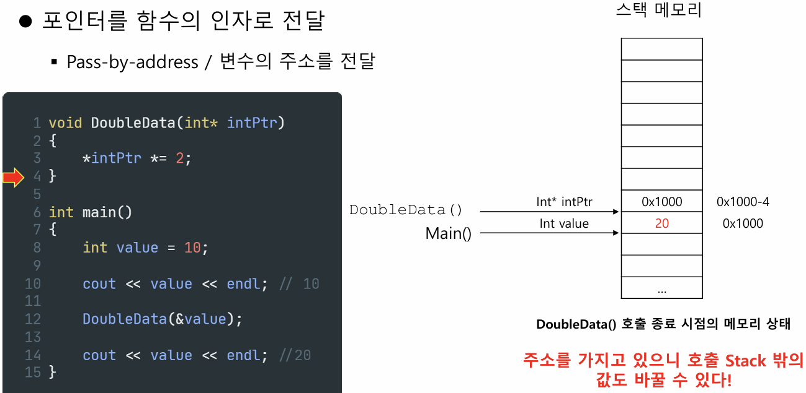

# 포인터

## 1. 포인터 개요

#### 1-1. 메모리에 대한 이해


**Stack 메모리의 특징**
- 매우 빠른 접근
- 변수를 명시적으로 해제할 필요 없음
- CPU가 효율적으로 관리해서 메모리 단편화 없음
- 지역 변수만 저장됨
- 스택 크기에 제한 있음
- 변수의 크기를 변경할 수 없음

**Heap 메모리의 특징**
- 변수에 전역적으로 접근 가능
- 메모리 크기에 제한 없음
- 접근 속도는 상대적으로 느림
- 메모리 공간이 효율적으로 사용된다는 보장이 없음 (할당과 해제 과정에서 단편화가 발생할 수 있음)
- 메모리 관리는 프로그래머가 직접 해야 함 (할당과 해제)
- realloc()로 변수 크기 변경 가능

#### 1-2. 포인터와 참조자의 차이
- '*' 의 사용  
  - 변수를 정의할 때 붙이면 → 포인터 변수의 정의  
  - 변수를 사용할 때 붙이면 → 포인터의 역참조
- '&' 의 사용  
  - 변수를 정의할 때 붙이면 → 참조자의 정의  
  - 변수를 사용할 때 붙이면 → 변수의 주소값 반환

```cpp
int* a;   // 포인터 변수 생성
*a;       // 포인터 역참조

int& b;   // 참조자 정의
&a;      // 변수의 주소값 반환
```

#### 1-3. 포인터가 그래서 뭔데?
- 포인터 변수는 변수의 한 종류로, **메모리 주소**를 저장한다.
  - 변수 타입: int, float, double, int*, float* 등.  
    int와 int*는 다른 타입.
- 포인터 타입 변수는 **메모리의 주소**를 값으로 가짐. 지금까지 사용한 일반 변수와 달리, 포인터는 값을 저장하는 대신 주소를 저장한다.
- 포인터는 가리키는 주소에 저장된 데이터의 타입을 알아야 제대로 읽고 쓸 수 있다.

**포인터를 사용하는 이유**
- **동적 할당**: 실행 중에 힙 영역에서 필요한 메모리 할당
- **범위 문제 해결**: 변수의 유효 범위를 벗어난 데이터에 접근 (참조자와 유사)
- 배열을 효율적으로 다루기 위해
- 다형성을 구현할 때 기본으로 사용됨
- 시스템 프로그래밍이나 임베디드 프로그래밍 등에서 메모리에 직접 접근할 때 필요

---

## 2. 포인터의 정의

#### 2-1. 정의 방법
변수 타입 뒤에 '*'를 붙여서 포인터 변수를 정의한다.
```cpp
variableType* pointerName;
```

#### 2-2. 포인터의 초기화
```cpp
int* intPtr = nullptr;
double* doublePtr = nullptr;
```
- 초기화를 하지 않으면 쓰레기 값을 가지게 되므로 반드시 초기화해야 한다.
- nullptr는 아무것도 가리키지 않는 상태를 나타낸다.

---

## 3. 주소로의 접근

#### 3-1. 변수의 주소값 얻어오기
- 포인터 변수는 주소값을 저장하므로, 주소 연산자(&)를 사용해 변수의 주소를 얻는다.
- 주소 연산자는 피연산자의 메모리 주소를 반환한다. 단, 피연산자는 l-value여야 한다.

```cpp
#include <iostream>
using namespace std;

int num = 10;

cout << "Value : " << num << endl;    // 10
cout << "Address : " << &num << endl;   // 예: 0x1000
// cout << "Address : " << &10 << endl; // Error! 리터럴은 주소를 가질 수 없음
```

또한:
```cpp
#include <iostream>
using namespace std;

int *p;

cout << "포인터 값 : " << p << endl;         // 쓰레기 값
cout << "포인터 변수의 주소 : " << &p << endl; // 포인터 변수의 주소
cout << "포인터 크기 : " << sizeof(p) << endl; // 보통 4바이트 (주소 크기)

p = nullptr;

cout << "초기화 후 포인터 값 : " << p << endl; // 0 (nullptr)
```

#### 3-2. 주소값의 이해
- 포인터 변수의 크기와 포인터가 가리키는 대상의 크기는 별개다.
- 모든 포인터 변수는 같은 크기를 가지며, x86(32비트) 환경에서는 4바이트다.

#### 3-3. 포인터의 타입
- 포인터 타입은, 해당 주소에 저장된 값이 어떤 타입인지 알아내기 위해 필요하다.
  - 예를 들어, int는 4바이트, float나 double은 크기가 다르므로, 어떤 타입의 값을 읽어야 할지 결정된다.

예시:
```cpp
int* p1 = nullptr;
double* p2 = nullptr;
unsigned long long* p3 = nullptr;
vector<string>* p4 = nullptr;
string* p5 = nullptr;
```
- 컴파일러는 포인터가 가리키는 타입을 확인해 올바른 크기만큼 읽고 쓴다.

```cpp
int score = 100;
double preciseScore = 100.7;

int* scorePtr = nullptr; // scorePtr은 int 타입의 메모리 주소만 가질 수 있음
scorePtr = &score;
scorePtr = &preciseScore; // Compiler Error!
```

---

## 4. 역참조

- 포인터가 가리키는 주소에 저장된 데이터에 접근하려면 '*' 연산자를 사용한다.

```cpp
#include <iostream>
using namespace std;

int score = 10;
int* scorePtr = &score;  // 포인터 변수 정의

cout << *scorePtr << endl;  // 10 출력

*scorePtr = 20;        // 역참조를 통해 값 변경
cout << *scorePtr << endl;  // 20 출력
cout << score << endl;      // 20 출력
```

---

## 5. 동적 메모리 할당

#### 5-1. 힙 메모리 할당의 필요성
- 실행 도중 필요한 메모리 크기를 미리 알 수 없을 때 사용한다.
  - 예: 사용자 입력에 따라 크기가 달라지거나, 파일에서 데이터를 읽어올 때
- 큰 데이터를 저장해야 할 경우 (스택은 몇 MB 정도밖에 안 됨)
- 객체의 생애주기를 직접 제어해야 할 때 유용하다.
- **중요:** 힙 메모리는 자동으로 해제되지 않으므로, 사용 후 반드시 해제해야 메모리 누수를 막을 수 있다.

#### 5-2. 동적 메모리 할당 방법
- `new` 연산자를 사용하여 힙에 메모리를 할당한다.
- `new`는 할당된 메모리의 주소를 반환한다.

```cpp
#include <iostream>
using namespace std;

int* intPtr = nullptr;

intPtr = new int;           // 힙에 int형 메모리 할당
cout << intPtr << endl;     // 할당된 메모리 주소 출력
cout << *intPtr << endl;    // 초기 쓰레기 값 출력

*intPtr = 100;
cout << *intPtr << endl;    // 100 출력
```

{width=400px}

#### 5-3. 메모리 상태 확인


#### 5-4. 동적 메모리 해제
- `delete` 연산자를 사용해 할당된 메모리를 해제한다.
```cpp
#include <iostream>
using namespace std;

int* intPtr = nullptr;

intPtr = new int;
cout << intPtr << endl;
cout << *intPtr << endl;

*intPtr = 100;
cout << *intPtr << endl;

delete intPtr;    // 메모리 해제
intPtr = nullptr; // 선택적으로 포인터 초기화
```

---

## 6. 포인터와 배열

- 배열의 이름은 배열의 첫 번째 요소의 주소를 가리킨다.
- 포인터 변수도 주소값을 저장하므로, 배열처럼 사용할 수 있다.

```cpp
#include <iostream>
using namespace std;

int scores[] = {100, 95, 90};
cout << scores << endl;      // 배열의 첫 요소 주소 출력
cout << *scores << endl;     // 100 출력

int* scorePtr = scores;
cout << scorePtr << endl;    // 배열과 같은 주소 출력
cout << *scorePtr << endl;   // 100 출력
```

또한:
```cpp
#include <iostream>
using namespace std;

int main() {
    int scores[] = {100, 95, 90};
    int* scoresPtr = scores;

    cout << scoresPtr << endl;         // 첫 번째 요소 주소
    cout << (scoresPtr + 1) << endl;     // 두 번째 요소 주소
    cout << (scoresPtr + 2) << endl;     // 세 번째 요소 주소

    cout << *scoresPtr << endl;        // 100 출력
    cout << *(scoresPtr + 1) << endl;    // 95 출력
    cout << *(scoresPtr + 2) << endl;    // 90 출력

    return 0;
}
```

---

## 7. 포인터와 const

#### 7-1. const가 붙은 포인터 (pointers to const)
- 데이터는 변경할 수 없고, 포인터는 다른 주소를 가리킬 수 있다.
```cpp
int highScore = 100;
int lowScore = 60;
const int* scorePtr = &highScore;

*scorePtr = 80;       // ERROR: const 데이터는 수정 불가
scorePtr = &lowScore; // OK
```

#### 7-2. const인 포인터 (const pointers)
- 포인터 자체가 상수여서, 한 번 초기화하면 다른 주소를 가리킬 수 없다. (단, 데이터는 변경 가능)
```cpp
int highScore = 100;
int lowScore = 60;
int* const scorePtr = &highScore;

*scorePtr = 80;         // OK
scorePtr = &lowScore;   // ERROR
```

#### 7-3. 포인터와 데이터 둘 다 const인 경우 (const pointers to const)
```cpp
int highScore = 100;
int lowScore = 60;
const int* const scorePtr = &highScore;

*scorePtr = 80;       // ERROR
scorePtr = &lowScore; // ERROR
```

---

## 8. 포인터의 pass-by-reference

#### 8-1. 포인터를 함수의 인자로 전달
- 변수의 주소를 전달해 함수 내에서 직접 값을 수정할 수 있다.




#### 8-2. 포인터의 반환
- 함수에서 포인터를 반환할 때는, 인자로 받은 포인터를 그대로 반환하거나, 동적으로 할당된 메모리의 주소를 반환할 수 있다.
```cpp
int* LargerInt(int* intPtr1, int* intPtr2) {
  if(*intPtr1 > *intPtr2)
    return intPtr1;
  else
    return intPtr2;
}
```

- 동적 메모리 할당 후 반환 예시:
```cpp
int* CreateArray(int size, int initValue = 0) {
  int* newStorage = new int[size];
  for (int i = 0; i < size; ++i)
    newStorage[i] = initValue;
  return newStorage;
}

int main() {
  int* myArray = CreateArray(100, 10);
  // 배열 사용 후
  delete[] myArray;
  return 0;
}
```

- **주의:** 지역 변수의 주소를 반환하면 안 된다.
```cpp
#include <iostream>
using namespace std;

int* DontDoThis() {
    int num = 10;
    return &num; // 위험: 함수 종료 후 num은 소멸됨
}

int main() {
    int* a = DontDoThis(); // a가 가리키는 주소는 유효하지 않음
    cout << *a << endl;    // 정의되지 않은 동작(Undefined Behavior)
    return 0;
}
```

---

## 9. 포인터 사용 시 주의사항

#### 9-1. 초기화의 필요성
- 포인터는 선언 후 반드시 초기화해야 한다.
- 초기화하지 않은 포인터를 사용하면 예측 불가능한 동작(Undefined Behavior)이 발생할 수 있다.
```cpp
int* intPtr;  // 선언 후 초기화 안 함

*intPtr = 100;  // 위험: 초기화되지 않은 포인터 사용
```

#### 9-2. 허상 포인터 (Dangling Pointer)
- 여러 포인터가 같은 메모리를 가리키다가, 한 포인터가 메모리를 해제하면 발생한다.
- 지역 변수를 가리키는 포인터를 함수가 반환한 후, 해당 스택 메모리가 해제되면 허상 포인터가 된다.
```cpp
int* getPointer() {
    int num = 10;  // 지역 변수
    return &num;   // 위험: 함수 종료 후 num 소멸
}

int main() {
    int* ptr = getPointer();
    cout << *ptr << endl;  // 정의되지 않은 동작
    return 0;
}
```

#### 9-3. new 연산자의 실패
- new 연산자로 동적 할당 시, 할당 실패할 수 있으므로 예외 처리를 고려해야 한다.

#### 9-4. 메모리 누수 (Memory Leak)
- 동적 할당한 메모리는 반드시 해제해야 한다.
- 해제하지 않으면 메모리 누수가 발생해 프로그램이 점점 더 많은 메모리를 사용하게 된다.

---

### 참고 자료
이 문서 작성에는 [YouTube Playlist: C++ Programming][playlist]를 참고했음.

[playlist]: https://www.youtube.com/playlist?list=PLMcUoebWMS1nzhlx-NbD4KBGEP1UCUDF_

