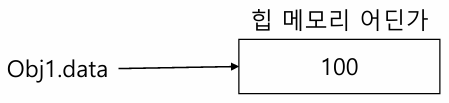
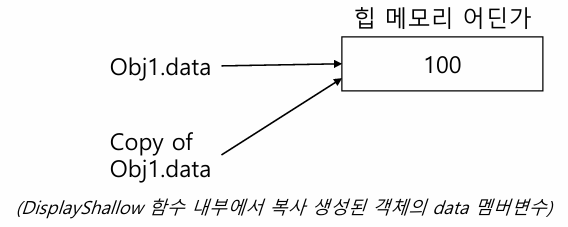
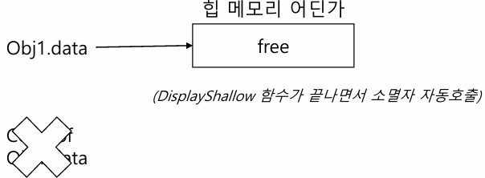
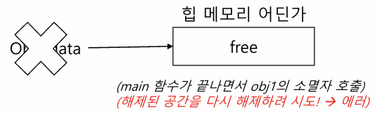
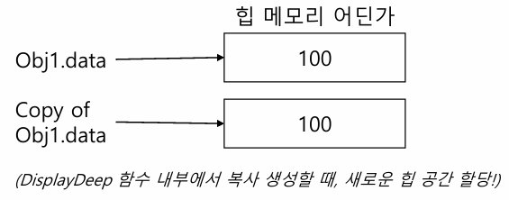

## 1. 복사 생성자 개요 

### 1.1. 복사 생성자
- 객체가 복사될 때 기존 객체를 기반으로 새로운 객체가 생성된다.
- 객체가 복사되는 경우:
  1. 객체를 pass-by-value 방식으로 함수의 매개변수로 전달할 때
  2. 함수에서 value 형태로 결과를 반환할 때
  3. 기존 객체를 기반으로 새로운 객체를 생성할 때
- 이러한 상황에서 객체가 "어떻게" 복사될지를 사용자가 정의해 주어야 한다.
  - 내가 만든 클래스이기 때문에, 잘못 복사하면 문제가 발생할 수 있다.
  - 기본적으로는 복사가 전혀 안 되지 않도록, 컴파일러가 자동으로 복사 생성자를 만들어준다.

### 1.2. 복사 생성자가 중요한 이유
- 복사 과정에서 문제가 발생할 수 있다 (특히 포인터가 존재하는 경우).
- 복사 비용에 대한 고려가 필요하다 (클래스가 많은 데이터를 포함할 수 있음).

### 1.3. 객체가 복사되는 경우

#### 1.3.1. Pass-by-value로 객체 전달 예시
```cpp
void DisplayPlayer(Player p) {
    p.Print();  // p는 main()의 hero 객체의 사본이다.
}               // DisplayPlayer 함수 종료 시 p의 소멸자가 호출됨

int main() {
    Player hero {0, 0, 1};
    DisplayPlayer(hero);
}
```

#### 1.3.2. Value 형태로 결과값 반환
```cpp
Player CreateSuperPlayer() {
    Player superPlayer {1, 1, 1};
    return superPlayer; // superPlayer 객체가 복사되어 main()의 지역 객체로 전달됨
}   // CreateSuperPlayer 함수 종료 시 superPlayer의 소멸자가 호출됨

int main() {
    Player player = CreateSuperPlayer();
    return 0;
}
```

#### 1.3.3. 기존 객체를 기반으로 새로운 객체 생성
```cpp
Player hero {1, 1, 1};

Player anotherHero = hero;  // hero를 복사하여 anotherHero 생성
// 또는
// Player anotherHero {hero};
```
이처럼 복사가 일어날 때, 복사본을 어떻게 만들어야 하는지를 사용자가 명시해 주어야 한다.
- 기본 데이터 타입(int, float 등)은 이미 정해진 방식이 있다.

---

## 2. 기본 복사 생성자

- 사용자가 복사 생성자를 구현하지 않으면, 기본 복사 생성자가 자동으로 생성되어 사용된다.
- 기본 복사 생성자는 멤버 변수들의 값을 복사하여 대입하는 방식이다.
- **포인터 타입의 멤버 변수가 존재할 때는 주의해야 한다.**
  - 기본 복사 생성자는 포인터 타입의 변수 또한 주소값만 복사한다.
  - 즉, 포인터가 가리키는 데이터 자체는 복사하지 않는다.

### 2.1. 복사 생성자의 선언
- 복사 생성자는 동일한 타입의 const 참조자를 인자로 받는다.
```cpp
Type::Type(const Type &source);

Player::Player(const Player &source);       // Player 클래스의 복사 생성자
Account::Account(const Account &source);    // Account 클래스의 복사 생성자
```

---

## 3. 얕은 복사 vs. 깊은 복사

### 3.1. 얕은 복사 생성자의 구현
- 자동 생성되는 복사 생성자는 '얕은 복사'를 수행한다.

**생성자 초기화 리스트를 사용한 방법**
```cpp
Player(const Player &other)
    : x{other.x}, y{other.y}, speed{other.speed}
{
}
```

**대입을 사용한 방법**
```cpp
Player(const Player &other) {
    x = other.x;
    y = other.y;
    speed = other.speed;
}
```

### 3.2. 얕은 복사의 문제점

**클래스 정의 (얕은 복사 예시)**
```cpp
class Shallow {
private: 
    int *data; // 포인터 멤버
public:
    Shallow(int d);                 // 생성자
    Shallow(const Shallow &source); // 복사 생성자
    ~Shallow();                     // 소멸자
};
```

**생성자 구현**
```cpp
Shallow::Shallow(int d) {
    data = new int;
    *data = d;
}
```

**소멸자 구현**
```cpp
Shallow::~Shallow() {
    delete data;
    std::cout << "free storage" << std::endl;
}
```

**문제점**
- 포인터가 가리키는 데이터가 아닌, 포인터 주소값 자체가 복사된다.
```cpp
int main() {
    Shallow obj1 {100};
    DisplayShallow(obj1);   // DisplayShallow 함수 내에서 복사된 obj1의 소멸자가 호출되어 data를 해제함
    return 0;
}   // main()에서 obj1의 소멸자가 다시 data를 해제하려 시도 -> 에러 발생
```
DisplayShallow 함수가 종료되면서 복사된 객체의 소멸자가 호출되고, main 함수가 종료되면서 원래 객체의 소멸자가 호출되어 이미 해제된 메모리를 다시 해제하려 하므로 에러가 발생한다.

{width=400px}
{width=400px}
{width=400px}
{width=400px}

### 3.3. 깊은 복사

**클래스 정의 (깊은 복사 예시)**
```cpp
class Deep {
private:
    int* data;  // 포인터 멤버
public:
    Deep(int d);                 // 생성자
    Deep(const Deep &source);    // 복사 생성자
    ~Deep();                     // 소멸자
};
```

**생성자 구현**
```cpp
Deep::Deep(int d) {
    data = new int;
    *data = d;
}
```

**소멸자 구현**
```cpp
Deep::~Deep() {
    delete data;
    std::cout << "free storage" << std::endl;
}
```

- 깊은 복사는 포인터의 주소값이 아니라, 해당 데이터 자체를 복사하여 새로운 힙 공간에 저장하는 방식이다.

**기본 버전의 깊은 복사**
```cpp
Deep::Deep(const Deep &source) {
    data = new int;         // 새로운 메모리 할당
    *data = *source.data;    // source의 데이터를 복사
    std::cout << "Copy constructor, deep" << std::endl;
}
```

**생성자 위임을 사용한 깊은 복사**
```cpp
Deep::Deep(const Deep &source)
    : Deep{*source.data}     // 다른 생성자를 호출하여 깊은 복사를 수행
{
    std::cout << "Copy constructor, deep" << std::endl;
}
```

- 깊은 복사의 경우, 데이터도 복사되므로 이중 해제 문제를 방지할 수 있다.

{width=400px}

```cpp
int main() {
    Deep obj1 {100};
    DisplayDeep(obj1); 
    return 0;
}
```

### 3.4. 복사 생성자 잘 사용하는 법
- 포인터 타입의 멤버 변수가 존재할 때는, (깊은) 복사 생성자를 직접 구현해야 한다.  
  - 새로운 힙 공간을 할당하여 값을 복사해 주어야 한다.
- STL이나 smart pointer를 사용하면, 내부적으로 안전한 복사 생성자가 구현되어 있거나 복사 제한(unique) 또는 공유 방식(shared)으로 관리된다.

---

## 4. this, const, static, friend

### 4.1. this 포인터
- C++의 키워드 중 하나로, 클래스의 멤버 함수가 호출될 때 자기 자신 객체의 주소를 가리키는 포인터이다.
- 멤버 함수 내부에서 객체 자신을 명확하게 참조할 때 사용한다.

```cpp
void Player::SetPosition(int x, int y) {
    x = x;  // 여기서 x는 매개변수 x를 의미한다.
    y = y;
}

void Player::SetPosition(int x, int y) {
    this->x = x;  // 왼쪽은 멤버 변수, 오른쪽은 매개변수
    this->y = y;
}
```

### 4.2. const 객체
- const-correctness 원칙에 따라, 변경되지 않아야 할 경우 변수에 const를 사용한다.
- const 객체의 멤버 변수는 변경할 수 없다.

```cpp
class Player {
private:
    int x, y;
    int speed;
public:
    Player(int x, int y, int speed)
        : x{x}, y{y}, speed{speed}
    {
        std::cout << this << std::endl;
    }
    void SetPosition(int x, int y) {  // 멤버 변수 값을 변경하므로 const 객체에서는 사용 불가
        this->x = x;
        this->y = y;
    }
    void PrintPosition() const {      // const 함수: 객체의 상태를 변경하지 않음
        std::cout << x << "," << y << std::endl;
    }
};

int main() {
    const Player p{1, 1, 1};
    // p.SetPosition(2, 2);  // ERROR: const 객체에서는 변경 불가
    p.PrintPosition();        // 사용 가능
}
```

### 4.3. static 클래스 멤버 변수/함수

#### 4.3.1. static 클래스 멤버 변수
- 객체가 아닌 **클래스에 속하는 변수**이다.
- 개별 객체의 데이터가 아닌, 클래스 전체에 공통인 데이터를 구현할 때 사용한다.

#### 4.3.2. static 클래스 멤버 함수
- 객체가 아닌 **클래스에 속하는 함수**이다.
- 클래스 이름을 통해 직접 호출할 수 있으며, static 멤버 변수에만 접근할 수 있다.

**Player.h**
```cpp
class Player {
private:
    static int numPlayers;
    // ...
public:
    static int GetNumPlayers();
    // ...
};
```

**Player.cpp**
```cpp
#include "Player.h"

int Player::numPlayers = 0;

int Player::GetNumPlayers() {
    return numPlayers;
}

// 생성자
Player::Player(int x, int y, int speed)
    : x{x}, y{y}, speed{speed}
{
    numPlayers++;
}

// 소멸자 
Player::~Player() {
    numPlayers--;
}
```

**main.cpp**
```cpp
void DisplayActivePlayers() {
    std::cout << "Active players: " << Player::GetNumPlayers() << std::endl;
}

int main() {
    DisplayActivePlayers(); // 0

    Player obj1 {1, 1, 1};
    DisplayActivePlayers(); // 1
    // ...
}
```
- static 변수는 stack이나 heap이 아닌 별도의 메모리 공간에 저장된다.

### 4.4. friend 키워드
- private 멤버에 접근할 수 있도록 특정 함수나 클래스를 선언할 때 사용한다.
- friend 관계는 비대칭적이며 전이되지 않는다.
  - A가 B의 friend라고 해서 B가 A의 friend는 아니며, A가 B의 friend이고 B가 C의 friend라고 해서 A가 C의 friend가 되지는 않는다.

```cpp
class Player {
    friend void DisplayPlayer(const Player& p);  // friend 함수 선언

private:
    int x, y;
    int speed;
public:
    Player(int x, int y, int speed)
        : x{x}, y{y}, speed{speed}
    {
        std::cout << this << std::endl;
    }
    void SetPosition(int x, int y) {
        this->x = x;
        this->y = y;
    }
};

// friend 함수 정의 (Player 클래스의 멤버 함수가 아님)
void DisplayPlayer(const Player& p) {
    std::cout << p.x << "," << p.y << std::endl;  // friend이므로 private 멤버에 접근 가능
}
```

---

### 참고 자료
이 문서 작성에는 [YouTube Playlist: C++ Programming][playlist]를 참고했음.

[playlist]: https://www.youtube.com/playlist?list=PLMcUoebWMS1nzhlx-NbD4KBGEP1UCUDF_
