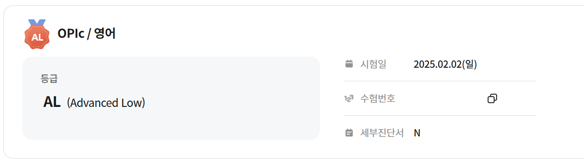

### 성적

다행히 첫트만에 목표했던 AL 등급을 받았다.

---

### OPIc 준비 이유

4학년 되기 전에 영어 성적 따놓으면 좋을 것 같아서... 어떤 시험을 준비할까 고민하던 중에, 카투사 훈련소에서 누군가가 오픽?이라는 시험을 보고 왔다고 했던 기억이 나서 찾아봤다. 지금까지 봤던 영어 시험은 수능이랑 토익밖에 없었는데, 뭔가 말하기 시험이 새로울 것 같아서 괜찮겠다는 생각이 들었다. 앞으로 살다 보면 영어 회화가 좀 더 중요할 것 같은데, 솔직히 토익은 회화에 별 도움이 되는 것 같지도 않다. 카투사 지원할 때 940점 받고 갔는데, 카투사 훈련소, 이병 때 거의 꿀 먹은 벙어리였던 거 생각하면... 오픽이 더 도움이 된다고 생각했고, 찾아보니 채용 시에도 요즘은 오픽 점수를 좀 더 봐주는 것 같기도 했다.

---

### 공부 추천

**1. 오픽노잼**
- IM 시리즈 ⟶ OPIc 시험의 개요 파악하기 좋음
- IH 시리즈 ⟶ 내가 약한 유형 관련 영상들 보기 좋음
- AL 시리즈 ⟶ 전체적인 시험 가이드와 고득점 tip들이 많아서 좋은 듯

IM, AL 시리즈의 경우 구글에 "오픽노잼 필기"를 검색하면, pdf로 필기를 정리해 놓은 자료들이 있다. 이 pdf 위에 필기하면서 공부했고, 시험 전까지도 이거만 봤다.

**2. 모의고사**

암만 오픽노잼 영상을 봐서 대충 감 잡아도, 내가 직접 말하려면 말이 진짜 안 나온다... 모의고사 연습하면서 다양한 주제에 대해 대답해보고, 녹음한 걸 들어보면서 현타도 좀 느껴야 실력이 늘 것 같다. 모의고사는 여우오픽, 제인시, 강지완 등 아무거나 봤다.

**3. ringle**

AI 오픽 채점을 해준다. 딱히 기대는 안했는데 나름 제대로 채점해주긴 한다. 문법적인 오류들을 잘 잡아준다. 49,000원에 AI 모의고사 4회를 해주는데, 할 만하다. 왜냐면 돈이 아까워서라도 열심히, 제대로 답변하려고 노력하게 된다... 각 문항마다 피드백을 해주고, 내 답변을 기반으로 한 AI 답변도 만들어줘서 다양한 주제 연습에 도움이 많이 된 듯하다.

**4. gpt**

- 내가 어떤 표현을 말하고 싶은데, 원어민처럼 자연스러운 표현이 뭐야? 라고 물어보면 잘 알려준다.
- 내가 선택한 서베이 관련 질문을 랜덤하게 만들어달라고 하면 잘 만들어준다.
- 내가 어떤 질문에 답변한 걸 녹음한 뒤 텍스트로 변환해서 gpt한테 알려주면, 첨삭도 해준다.

**5. 센스있는 영어표현 - 에디 리 지음**

유튜브에 어떤 유학생 형님이 쇼츠로 회화 알려주는게 좋아서 이 사람 책을 샀었는데, 200개의 표현이 있다. 잘 안 보다가 오픽 시험 준비한다고 봤는데 확실히 수능 영어나 토익에서 볼 수 없는 자연스러운 회화 표현이 많아서 도움이 좀 된 것 같다. 

---

### 내가 느끼기에 중요한 것

**1. OPIc은 formal한 시험이 아니다**

답변을 교과서적으로 하면 안 된다. 나는 그냥 같이 군생활하던 미군 흑인 친구들한테 말한다고 생각하면서 답변했는데, 적당한 슬랭이나 일상적인 표현들을 많이 쓰는 게 좋은 듯하다. OPIc 채점관들이 듣다가 웃을 수 있는 주제도 있으면 좋다.

예를 들어, '병원'에 대한 어릴 적 기억이나 인상을 묻는 질문이 있었는데, 그냥 간호사들이 너무 예뻐서 좋았다고 답했다. 안 아파도 간호사 누나들 보러 병원 가자고 말하면서 웃었다.

"There were so hot. The nurses... damm... they were like super models... You know? I think this doctor knew how to run his business ㅋㅋ" 이런 식으로 말했다.

**2. MP는 두괄식으로 간결하게**

오픽노잼 말대로!

**3. 시험장에서**

질문은 무조건 두 번 듣는다.

첫 질문을 들을 때는 질문 주제와 질문 카테고리를 파악한다. 콤보 셋의 경우, 1/2/3 중 처음과 두 번째는 description, habit이 나오는 경향이 있고, 두 번째와 세 번째는 past experience와 comparison이 나오니 질문 듣기 버튼 누르기 전에 인지하고 들어야 한다.

두 번째 질문을 들을 때는 무조건 MP만!! 생각한다.

**4. 강서 CBT 센터 가라**
나도 집에서 한 시간 거리에 있었지만... 완전히 유리로 차단되어 있어서 다른 수험자들 소리가 하나도 들리지 않아서 집중하기 좋았다. 다른 시험장은 시끄럽다고 하더라.
