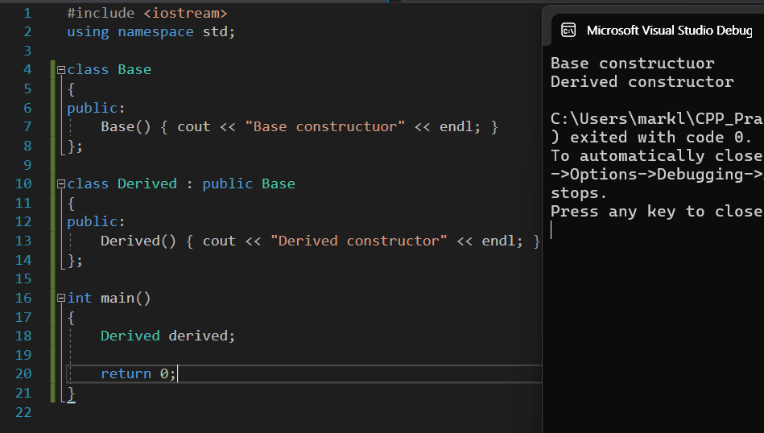
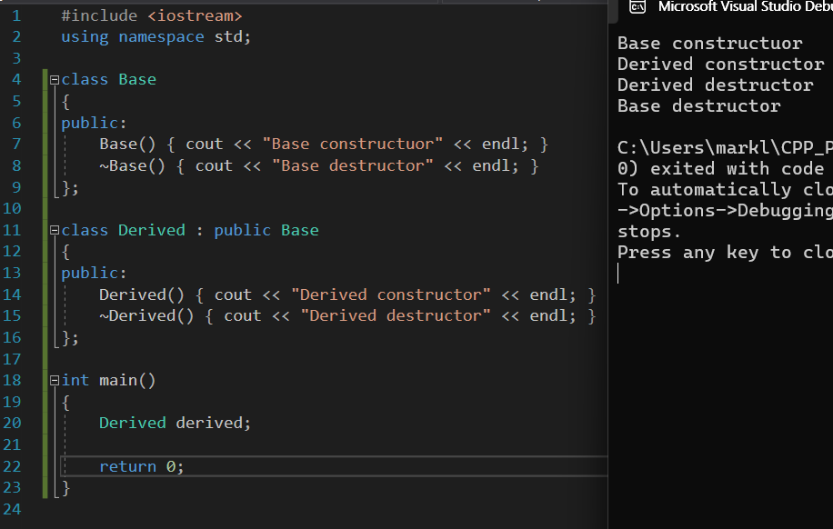

# 상속

## 1. 상속이 필요한 이유

### 1.1. 코드 예시

**Player 클래스**
```cpp
class Player
{
private:
    int x, y;   // 플레이어의 현재 위치 좌표
    int speed;  // 플레이어의 이동 속도
public:
    Player(int x, int y, int speed)  // 생성자: 초기 위치(x, y)와 이동 속도(speed)를 설정
        : x{ x }, y{ y }, speed{ speed }
    {}

    void Move(int dx, int dy)  // 이동 함수: 입력된 방향(dx, dy)에 speed를 곱하여 위치 변경
    {
        x += dx * speed;
        y += dy * speed;
    }

    void ShowPosition()  // 현재 위치 출력 함수
    {
        cout << x << "," << y << endl;
    }
};
```

**Player 관리를 위한 클래스 (컨트롤/매니저 클래스)**
```cpp
class PlayerHandler
{
private:
    Player* playerList[50];  // 최대 50명의 Player 객체를 관리 (Player 객체의 포인터 저장)
    int playerNum;           // 현재 등록된 플레이어 수
public:
    // 생성자: 초기 등록된 플레이어 수를 0으로 설정
    PlayerHandler() : playerNum{ 0 } {}

    // Player 객체의 포인터를 배열에 추가하고, 등록된 플레이어 수를 증가시킴
    void AddPlayer(Player* p)
    {
        playerList[playerNum++] = p;  
    }

    // 모든 플레이어의 현재 위치를 출력하는 함수
    void ShowAllPlayerPosition() const
    {
        for (int i = 0; i < playerNum; i++)
        {
            playerList[i]->ShowPosition();
        }
    }

    // 소멸자: 등록된 모든 Player 객체를 삭제하여 동적 할당된 메모리를 해제
    ~PlayerHandler()
    {
        for (int i = 0; i < playerNum; i++)
        {
            delete playerList[i];
        }
    }
};
```

**main 함수**
```cpp
int main()
{
    PlayerHandler playerHandler;
    playerHandler.AddPlayer(new Player(1, 1, 1));
    playerHandler.AddPlayer(new Player(5, 5, 1));
    playerHandler.AddPlayer(new Player(2, 3, 1));
    playerHandler.ShowAllPlayerPosition();
}
```

### 1.2. 상속이 필요한 이유
- 만약 Player 이외에 Enemy, NPC 등이 추가된다면?
- Enemy와 NPC의 이동 방식이 다르다면 (예: Enemy는 `dx * speed * 1.5f;`, NPC는 이동 불가능),
- 각 클래스별로 별도의 관리(예: enemyNum, npcNum 등)와 출력, 해제 코드가 필요해진다.

⟶ **상속과 다형성을 활용하면, 최소한의 수정으로 다양한 기능을 추가할 수 있도록 설계할 수 있다!**

---

## 2. 상속의 정의
- 상속은 기존 클래스를 활용하여 새로운 클래스를 생성하는 방법이다.
- 새로운 클래스는 **기존 클래스의 데이터와 기능(함수)를 포함**하므로, 기존 클래스를 재사용할 수 있다.
- 클래스들 간의 공통 속성에 집중하여 설계할 수 있으며, 기본 클래스의 기능을 오버라이딩하여 확장할 수 있다.
  - 즉, 기존 클래스를 직접 수정할 필요 없이 새로운 클래스로 확장할 수 있다.

**상속을 사용하지 않은 예**
```cpp
class Player {
    // x, y, speed, hp, xp, ...
};

class Enemy {
    // x, y, speed, xp, gold, ...
};

class NonPlayer {
    // x, y, dialog, ...
};
```

**상속을 사용한 경우**
```cpp
class Entity {
    // x, y, Talk() ⟶ 공통 데이터 및 기능
};

class Player : public Entity {
    // speed, hp, xp, Move()
};

class Enemy : public Entity {
    // speed, hp, gold, Move()
};

class NonPlayer : public Entity {
    // dialog
};
```

- 이 경우, Player 객체는 **Player 타입이면서 동시에 Entity 타입**이다.

**용어 정리**
- **기본 클래스 (Base Class/Parent Class/Super Class)**: 상속의 대상이 되는 클래스.
- **유도 클래스 (Derived Class/Child Class/Sub Class)**: 기본 클래스로부터 생성되는 클래스.

---

## 3. 유도 클래스

### 3.1. C++ 상속 문법
```cpp
class Base {
    // base class members...
};

class Derived : public Base {
    // derived class members...
};
```
- **public 상속**은 가장 흔하게 사용되며, "is-a" 관계를 잘 나타낸다.

### 3.2. 예시 코드
```cpp
#include <iostream>
using namespace std;

class Entity
{
protected:
    int x;
    int y;
public:
    Entity(int x, int y)
        : x{ x }, y{ y } {}
    void ShowPosition()
    {
        cout << "[" << x << "," << y << "]" << endl;
    }
    void Talk()
    {
        cout << "Hello." << endl;
    }
};

class Player : public Entity
{
private:
    int speed;
    int hp;
    int xp;
public:
    Player(int x, int y, int speed)
        : Entity(x, y), speed{ speed } {}
    void Move(int dx, int dy)
    {
        // x, y는 Entity의 protected 멤버이므로 유도 클래스에서 접근 가능
        x += dx;
        y += dy;
    }
    void SetHP(int hp)
    {
        if (hp < 0)
            return;
        this->hp = hp;
    }
};

int main()
{
    Entity e{ 1, 1 };
    e.ShowPosition();
    e.Talk();

    Player p{ 1, 1, 2 };
    p.Move(1, -1);
    p.ShowPosition();
    p.Talk();
    // p.hp = 10;  // ERROR: private 멤버 변수 접근 불가
    p.SetHP(10);   // OK
}
```

---

## 4. Protected Member

```cpp
class Base
{
public:
    int a;

protected:
    int b;

private:
    int c;
};

class Derived : public Base
{
public:
    void SetValue()
    {
        cout << a << endl;  // OK
        cout << b << endl;  // OK
        // cout << c << endl;  // ERROR
    }
};

int main()
{
    Derived d;
    d.a = 1;   // OK
    // d.b = 2;  // ERROR: protected 멤버는 객체를 통해 접근 불가
    // d.c = 3;  // ERROR: private 멤버 접근 불가

    cout << sizeof(Base) << endl;    // 예: 12 bytes
    cout << sizeof(Derived) << endl; // 예: 12 bytes
}
```
- **Protected 멤버**는 기본 클래스와 그를 상속받은 유도 클래스 내부에서만 접근할 수 있으며, 객체를 통해서는 접근할 수 없다.

---

## 5. 상속에서의 생성자와 소멸자

### 5.1. 상속에서의 생성자
- 유도 클래스 객체가 생성될 때, 먼저 기본 클래스의 생성자가 호출되고 그 다음 유도 클래스의 생성자가 호출된다.
- 즉, 유도 클래스의 초기화 전에 기본 클래스의 멤버가 반드시 초기화되어야 한다.



### 5.2. 상속에서의 소멸자
- 소멸자는 생성자의 호출 순서와 반대로, 유도 클래스의 소멸자가 먼저 호출되고 그 후 기본 클래스의 소멸자가 호출된다.



---

## 6. 기본 클래스 생성자와의 관계

### 6.1. 생성자 오버로딩
```cpp
#include <iostream>
using namespace std;

class Base
{
private:
    int value;
public:
    Base() : value{ 0 } { cout << "Base no-args constructor" << endl; }
    Base(int x) : value{ x } { cout << "Base (int) overloaded constructor" << endl; }
    ~Base() { cout << "Base destructor" << endl; }
};

class Derived : public Base
{
private:
    int doubled_value;
public:
    Derived() : Base{}, doubled_value{ 0 } { cout << "Derived no-args constructor" << endl; }
    Derived(int x) : Base{x}, doubled_value { x * 2 } { cout << "Derived (int) overloaded constructor" << endl; }
    ~Derived() { cout << "Derived destructor" << endl; }
};

int main()
{
    Base b1;          // value: 0
    Base b2{ 100 };   // value: 100
    Derived d1;       // Base: value 0, doubled_value: 0
    Derived d2{ 1000 };  // Base: value 1000, doubled_value: 2000
}
```
- 유도 클래스의 생성자에서 기본 클래스의 생성자를 초기화 리스트를 통해 명시적으로 호출할 수 있다.

### 6.2. 복사 생성자와 상속
- 복사 생성자는 컴파일러가 자동 생성하지만, 필요한 경우 직접 구현할 수 있다.
- 유도 클래스의 복사 생성자에서는 기본 클래스의 복사 생성자를 명시적으로 호출할 수 있다.

```cpp
class Base {
    int value;
public:
    Base(const Base &other) : value{ other.value }
    { cout << "Base Copy constructor" << endl; }
};

class Derived : public Base {
    int doubled_value;
public:
    Derived(const Derived &other)
        : Base{ other }, doubled_value{ other.doubled_value }
    {
        cout << "Derived Copy Constructor" << endl;
    }
};
```
- 만약 유도 클래스에서 복사 생성자를 구현하지 않으면, 컴파일러는 기본 클래스의 기본 생성자를 호출한다는 점에 유의해야 한다.
- 포인터 멤버 변수가 있는 경우에는 깊은 복사 등을 위해 복사 생성자 구현에 주의해야 한다.

---

## 7. 상속과 멤버 함수

### 7.1. 기본 클래스의 멤버 함수 사용
- 유도 클래스는 기본 클래스의 public 및 protected 멤버 함수를 직접 호출할 수 있다.
- 또한, 유도 클래스는 기본 클래스의 멤버 함수를 오버라이드(재정의)할 수 있다.
- 만약 기본 클래스의 함수를 오버라이드하여 가려진 경우, `Base::함수명()` 형식으로 호출할 수 있다.

### 7.2. 예시 코드
```cpp
class Entity {
protected:
    int x, y;
public:
    Entity(int x, int y)
        : x{ x }, y{ y } {}
    void Talk() {
        cout << "Hello" << endl;
    }
    void ShowPosition() {
        cout << x << "," << y << endl;
    }
};

class Player : public Entity {
private:
    int speed;
public:
    Player(int x, int y, int speed)
        : Entity(x, y), speed{ speed } {}
    void Talk() {   // 기본 클래스의 Talk() 함수를 오버라이드
        cout << "Hello. I'm Player" << endl;
    }
};

int main() {
    Entity e{ 1, 1 };
    e.Talk();  // Entity::Talk() 호출

    Player p{ 1, 1, 2 };
    p.Talk();         // Player::Talk() 호출
    p.ShowPosition(); // 상속받은 Entity::ShowPosition() 호출
}
```

### 7.3. 정적 바인딩
- 만약 유도 클래스와 기본 클래스에 같은 이름과 인자를 가진 함수가 있을 경우, 호출되는 함수는 포인터나 참조의 타입에 따라 정적으로 결정된다.
- C++의 기본 바인딩 방식은 정적 바인딩이다.
  - 예를 들어, 아래 코드에서 `Entity *ePtr = new Player{...};`일 경우, `ePtr->Talk()`는 Entity::Talk()를 호출한다.
```cpp
Entity e{1,1};
e.Talk();   // Entity::Talk() 호출

Player p{1,1,2};
p.Talk();   // Player::Talk() 호출

Entity* ePtr = new Player{1,1,2};
ePtr->Talk();   // 정적 바인딩으로 Entity::Talk() 호출
```

---

## 8. Is-A 관계

- 기본 클래스 타입을 사용하는 곳에는 유도 클래스 객체를 사용할 수 있다.
  - 유도 클래스는 기본 클래스의 모든 멤버를 포함하므로 "is-a" 관계를 형성한다.
- 예를 들어, Player 객체는 Entity 타입으로 취급될 수 있다.

```cpp
void TalkSomething(Entity e)    // Entity 타입 객체를 매개변수로 받음
{
    e.Talk();
}

void ShowSomething(Entity e)
{
    e.ShowPosition();
}

int main()
{
    Player p{0, 0, 1};
    TalkSomething(p);   // Player 객체 p를 Entity 타입으로 전달 (객체 slicing 발생할 수 있음)
    ShowSomething(p);
}
```

또한,
```cpp
int main()
{
    Entity p = Player{1,1,1};           // 객체 slicing 발생
    Entity* ePtr = new Player{1,1,1};     // 업캐스팅 허용
    Entity& pRef = p;                   // 기본 클래스 타입의 참조 생성
    pRef.ShowPosition();

    // Player* pPtr = new Entity{1,1,1}; // ⚠️ 오류 발생!
}
```

---

### 참고 자료
이 문서 작성에는 [YouTube Playlist: C++ Programming][playlist]를 참고했음.

[playlist]: https://www.youtube.com/playlist?list=PLMcUoebWMS1nzhlx-NbD4KBGEP1UCUDF_