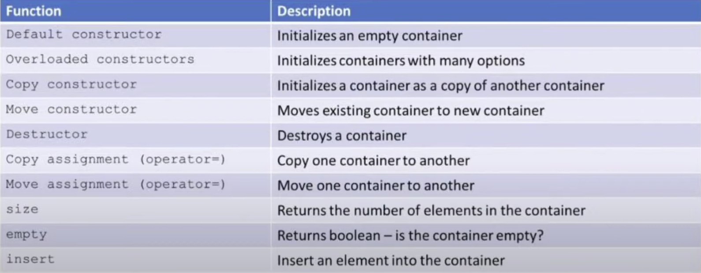
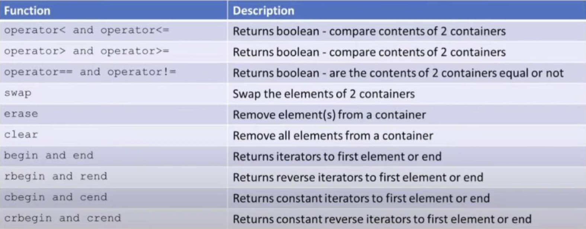

---
layout: single
title: "STL"
---

# Standard Template Library (STL)

STL은 C++ 표준 라이브러리의 한 부분으로, 템플릿을 사용해 구현된 다양한 컨테이너, 알고리즘, 반복자 등의 집합이다. STL은 강력하고 재사용 가능하며, 범용적(generic)인 자료구조와 알고리즘을 제공하여 효율적인 프로그래밍을 가능하게 한다.

--------------------------------------------------

## 1. STL 개요

### 1.1 개요
- **정의:**  
  STL은 템플릿을 사용해 구현된 컨테이너들의 집합으로, 데이터를 저장하기 위한 객체(컨테이너)와 그 데이터를 다루기 위한 알고리즘, 그리고 이들을 연결하는 반복자(iterator)로 구성된다.
- **특징:**  
  - Powerful, reusable, adaptable, generic, HUGE!
  - 널리 사용되는 자료구조와 알고리즘이 구현되어 있으며, 시간 복잡도는 각 컨테이너나 알고리즘의 레퍼런스 문서를 참고할 수 있음.

### 1.2 구성요소
1. **컨테이너 (Containers)**
   - 데이터를 저장하는 객체
   - 예: array, vector, deque, stack, set, map, ...
   - 각 컨테이너는 관련 헤더 파일이 필요함 (예: `#include <vector>`)
2. **알고리즘 (Algorithms)**
   - 컨테이너의 요소들을 다루기 위한 함수들
   - 예: find, max, count, accumulate, sort, ...
3. **반복자 (Iterators)**
   - 컨테이너 요소들에 대한 추상적 접근 수단 (포인터와 유사)
   - 다양한 종류: forward, reverse, const, 등

### 1.3 컨테이너의 종류
- **Sequential 컨테이너**  
  - 삽입 순서를 유지하는 컨테이너
  - 예: array, vector, deque, list, forward_list
- **Associative 컨테이너**  
  - 키(key)를 기준으로 저장하며, 정렬 규칙에 따라 관리되는 컨테이너
  - 예: set, multiset, map, multimap
- **컨테이너 어댑터**  
  - 기존 컨테이너를 변형하여 사용하는 형태
  - 예: stack, queue, priority_queue

### 1.4 컨테이너의 공통 기능
- 모든 STL 컨테이너는 공통적으로 size(), empty(), begin(), end(), front(), back(), swap() 등의 함수를 제공한다.
- 아래 이미지들은 STL 컨테이너의 공통 기능 및 사용법에 대해 시각적으로 정리한 자료이다.
  - 
  - 

### 1.5 STL 사용 시 유의점
- **요소 복사:**  
  컨테이너에 저장될 때 요소는 복사되어 저장된다. 기본 자료형은 문제가 없으나, 사용자 정의 자료형은 복사 생성자와 대입 연산자가 올바르게 구현되어 있어야 한다.
- **Associative 컨테이너:**  
  요소의 정렬 및 검색을 위해 비교 연산자(예: operator<, operator==)가 필요하다.

--------------------------------------------------

## 2. STL 반복자

### 2.1 개요
- 반복자는 컨테이너의 요소에 대해 추상적인 접근을 제공하며, 컨테이너의 내부 구현을 몰라도 요소들을 순회할 수 있게 해준다.
- 반복자는 포인터처럼 사용되며, 대부분의 컨테이너에서 begin()과 end() 함수로 얻을 수 있다.
- 단, stack, queue와 같이 내부적으로 순차적 접근이 불가능한 컨테이너는 반복자를 제공하지 않는다.

### 2.2 반복자 선언
컨테이너 타입에 맞는 반복자는 아래와 같이 선언한다:
```cpp
std::vector<int>::iterator it1;
std::list<std::string>::iterator it2;
std::map<std::string, std::string>::iterator it3;
std::set<char>::iterator it4;
```

### 2.3 반복자의 begin()과 end()
- **vector 예:**
  ```cpp
  std::vector<int> vec{1, 2, 3};
  vec.begin(); // 첫 번째 요소를 가리킴
  vec.end();   // 마지막 요소의 뒤를 가리킴!
  ```
- **set 예:**
  ```cpp
  std::set<char> ch{'A', 'E', 'D', 'B'};
  ch.begin(); // 정렬된 첫 요소 (예: 'A')를 가리킴
  ch.end();   // 마지막 요소의 뒤를 가리킴
  ```

### 2.4 반복자의 초기화
```cpp
std::vector<int> vec{1, 2, 3};
std::vector<int>::iterator it = vec.begin();  // 명시적 선언
auto it2 = vec.begin();  // auto 키워드 사용 (더 간결)
```

### 2.5 Auto 키워드
- `auto`는 반복자의 타입이 길 때, 자동으로 타입을 추론해준다.
- 단, 과도한 사용은 코드 가독성에 영향을 줄 수 있다.

### 2.6 반복자의 연산자
- 반복자는 포인터와 유사하게 `*`, `++`, `--`, `+=` 등의 연산자를 지원한다.
- 아래 예제는 vector 반복자에 대해 연산자를 사용하는 예이다:
```cpp
#include <iostream>
#include <vector>
int main() {
    std::vector<int> vec{1, 4, 7};
    auto it = vec.begin();
    it += 2;
    std::cout << *it << std::endl; // 출력: 7
}
```

### 2.7 반복자의 사용 예제
- **for 문 사용 (명시적 반복자):**
  ```cpp
  #include <iostream>
  #include <vector>
  int main() {
      std::vector<int> vec{1, 2, 3};
      for (std::vector<int>::iterator it = vec.begin(); it != vec.end(); ++it) {
          std::cout << *it << std::endl;
      }
  }
  ```
- **for 문 사용 (auto):**
  ```cpp
  #include <iostream>
  #include <vector>
  int main() {
      std::vector<int> vec{1, 2, 3};
      for (auto it = vec.begin(); it != vec.end(); ++it) {
          std::cout << *it << std::endl;
      }
  }
  ```
- **while 문 사용:**
  ```cpp
  #include <iostream>
  #include <vector>
  int main() {
      std::vector<int> vec{1, 4, 7};
      auto it = vec.begin();
      while (it != vec.end()) {
          std::cout << *it << " ";
          ++it;
      }
  }
  ```
- **set 컨테이너 예제 (추상화):**
  ```cpp
  #include <iostream>
  #include <set>
  int main() {
      std::set<char> mySet{'A', 'B', 'D'};
      for (auto it = mySet.begin(); it != mySet.end(); ++it) {
          std::cout << *it << std::endl;
      }
  }
  ```

### 2.8 역 반복자 (Reverse Iterator)
- 역 반복자는 컨테이너를 역순으로 순회할 때 사용한다.
```cpp
#include <iostream>
#include <vector>
int main() {
    std::vector<int> vec{1, 2, 3};
    for (auto rit = vec.rbegin(); rit != vec.rend(); ++rit) {
        std::cout << *rit << " ";
    }
    // 출력: 3 2 1
}
```

### 2.9 기타 반복자 종류
- `iterator` : begin() / end()
- `const_iterator` : cbegin() / cend()  (요소를 변경하지 않음)
- `reverse_iterator` : rbegin() / rend()
- `const_reverse_iterator` : crbegin() / crend()

--------------------------------------------------

## 3. STL 알고리즘

### 3.1 개요
- STL 알고리즘은 반복자에 의해 지정된 요소 집합에 대해 다양한 연산을 수행한다.
- 예를 들어, 요소 검색, 정렬, 누적 합계 등을 지원하며, 모든 알고리즘은 반복자를 인자로 받는다.
- 함수 인자를 전달하는 방법으로는 functor, function pointer, lambda expression(C++11)이 있다.

### 3.2 알고리즘과 반복자
- 알고리즘을 사용하기 위해서는 `#include <algorithm>`이 필요하며, 반복자가 유효한 범위를 제공해야 한다.
- 반복자가 가리키던 요소가 삭제되면, 해당 반복자는 무효해질 수 있다.

### 3.3 알고리즘 예제

#### 3.3.1 find
```cpp
#include <iostream>
#include <vector>
#include <algorithm>
int main() {
    std::vector<int> vec{1, 3, 7, 4, 8, 10};
    auto location = std::find(vec.begin(), vec.end(), 4);
    if (location == vec.end()) {
        std::cout << "cannot find" << std::endl;
    } else {
        std::cout << *location << std::endl;
    }
}
```

#### 3.3.2 for_each
- **Functor 사용 예:**
  ```cpp
  #include <iostream>
  #include <vector>
  #include <algorithm>
  struct Func {
      void operator()(int x) {
          std::cout << x * x << std::endl;
      }
  };
  int main() {
      std::vector<int> vec{1, 3, 7, 4, 8, 10};
      std::for_each(vec.begin(), vec.end(), Func());
  }
  ```
- **Function Pointer 사용 예:**
  ```cpp
  #include <iostream>
  #include <vector>
  #include <algorithm>
  void f(int x) {
      std::cout << x * x << std::endl;
  }
  int main() {
      std::vector<int> vec{1, 3, 7, 4, 8, 10};
      std::for_each(vec.begin(), vec.end(), f);
  }
  ```
- **Lambda Expression 사용 예:**
  ```cpp
  #include <iostream>
  #include <vector>
  #include <algorithm>
  int main() {
      std::vector<int> vec{1, 3, 7, 4, 8, 10};
      std::for_each(vec.begin(), vec.end(),
          [](int x) { std::cout << x * x << std::endl; });
  }
  ```

--------------------------------------------------

## 4. STL 컨테이너

STL 컨테이너는 크게 두 그룹으로 나눌 수 있다: **Sequential 컨테이너**와 **Associative 컨테이너**. 또한, 이들을 변형한 **컨테이너 어댑터**도 있다.

### 4.1 Sequential 컨테이너
#### 4.1.1 Array
- **std::array**:  
  고정 크기 배열로, 기존의 raw array와 거의 유사하지만 STL의 장점을 가진다.
  ```cpp
  #include <iostream>
  #include <array>
  int main() {
      std::array<int, 5> arr1{1, 2, 3, 4, 5};
      std::array<std::string, 3> arr2{"Kim", "Lee", "Park"};
  }
  ```
- **주요 함수:**  
  size(), at(), front(), back(), empty(), max_size(), fill(), swap(), data() 등.

#### 4.1.2 Vector
- **std::vector**:  
  가변 크기 배열로, 요소의 직접 접근이 가능하며, 끝에 요소를 추가(push_back)하거나 제거(pop_back)하는 연산이 빠르다.
  ```cpp
  #include <iostream>
  #include <vector>
  int main() {
      std::vector<int> vec{1, 2, 3, 4, 5};
      std::cout << vec.size() << std::endl;
      std::cout << vec.capacity() << std::endl;
      std::cout << vec.front() << " " << vec.back() << std::endl;
  }
  ```

#### 4.1.3 List & Forward List
- **std::list**:  
  양방향 연결 리스트. 요소의 삽입 및 삭제가 빠르지만, 임의 접근은 불가능하다.
  ```cpp
  #include <iostream>
  #include <list>
  #include <algorithm>
  void PrintList(const std::list<int>& lst) {
      for (auto it = lst.begin(); it != lst.end(); ++it)
          std::cout << *it << " ";
      std::cout << std::endl;
  }
  int main() {
      std::list<int> myList{1, 2, 3, 4, 5};
      PrintList(myList);
      auto it = std::find(myList.begin(), myList.end(), 3);
      myList.insert(it, 10);
      PrintList(myList);
      myList.erase(it);
      PrintList(myList);
  }
  ```
- **std::forward_list**:  
  단방향 연결 리스트. 메모리 사용이 효율적이며, 삽입과 삭제가 빠르다.

### 4.2 Associative 컨테이너
#### 4.2.1 Set
- **std::set**:  
  중복된 요소가 없으며, 키에 따라 자동 정렬된다.
  ```cpp
  #include <iostream>
  #include <set>
  int main() {
      std::set<int> s{3, 1, 5, 4, 2};
      for (auto it = s.begin(); it != s.end(); ++it)
          std::cout << *it << " "; // 출력: 1 2 3 4 5
  }
  ```
- **기타:**  
  multiset, unordered_set, unordered_multiset 등.

#### 4.2.2 Map
- **std::map**:  
  key-value 쌍으로 데이터를 저장하며, key에 따라 정렬된다.
  ```cpp
  #include <iostream>
  #include <map>
  int main() {
      std::map<std::string, int> m1{
          {"Kim", 20},
          {"Lee", 21},
          {"Park", 25}
      };
      std::cout << m1["Kim"] << std::endl;  // 출력: 20
      m1["Kim"] = 22;
      std::cout << m1["Kim"] << std::endl;  // 출력: 22
      m1.insert(std::make_pair("Choi", 30));
  }
  ```
- **기타:**  
  multimap, unordered_map, unordered_multimap 등.

### 4.3 컨테이너 어댑터
- **컨테이너 어댑터**:  
  기존 컨테이너를 변형하여 사용하는 형태로, stack, queue, priority_queue 등이 있다.

--------------------------------------------------

## 5. STL 정리

- **컨테이너:**  
  array, vector, deque, stack, set, map 등으로 구성되며, 각각의 헤더 파일을 포함해야 한다.
- **알고리즘:**  
  find, max, count, accumulate, sort 등 컨테이너 요소를 다루기 위한 알고리즘을 제공한다.
- **반복자:**  
  컨테이너의 요소들에 대한 추상적 접근을 제공하며, 포인터와 유사하게 동작한다.

--------------------------------------------------

### 참고 자료
이 문서 작성에는 [YouTube Playlist: C++ Programming][playlist]를 참고했음.

[playlist]: https://www.youtube.com/playlist?list=PLMcUoebWMS1nzhlx-NbD4KBGEP1UCUDF_

