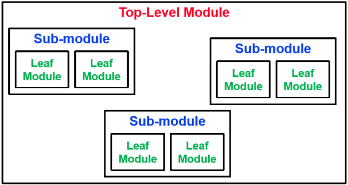
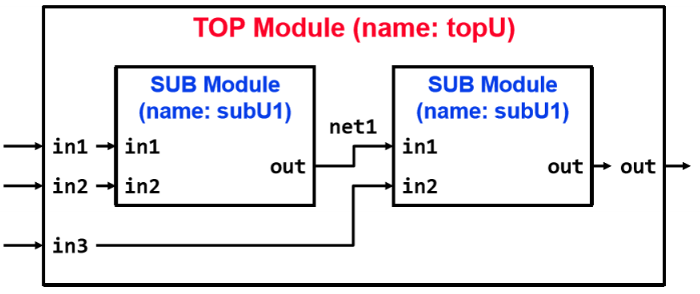

## 1. What is Verilog?

### 1.1. RTL
- **RTL (Register Transfer Level)** 모델이란, register transfer 수준에서 하드웨어를 표현하는 것
- 현실적인 `delay` 등의 요소가 없는 이상적인 상황에서 기능을 검증하는 모델
- 실제 회로에 구현하기 전에 기능이 검증되어야 함

### 1.2. HDL (Hardware Description Language)
- HDL은 **한 사이클마다** 어떤 동작이 일어나는지를 설명
- 설명하고자 하는 동작 예시:
  - 어떤 데이터가 메모리에서 읽히는가?
  - 데이터가 어떻게 수정되는가? (`combinational logic` 사용)
  - 수정된 데이터가 어디에 저장되는가?

### 1.3. C/C++ 대신 HDL을 사용하는 이유
1. 하드웨어 구조에 대한 더 쉬운 표현이 가능하며 관련 syntax가 정의됨
   - `wire`, `gate`, `register`, `flip-flop`, `clock`, `rising/falling edge` 등
   - `combinational logic` 및 `sequential logic`
2. 하드웨어의 병렬성 표현에 용이

⟶ **하드웨어 관점의 로직 설계를 명확히 표현하기 위해 Verilog 사용**

---

## 2. Modular Design

### 2.1. 모듈이란?
- 객체지향의 클래스와 비슷하며, 베릴로그에서 가장 핵심 블록
- 모듈의 상세
  - 이름, Input/Output, 기능

### 2.2. Adder 예시
```verilog
`timescale 1ns / 100ps

module Adder (
    input clk,
    input rst,
    input [31:0] in,
    output [31:0] out);

    reg [31:0] acc;
    
    assign out = in + acc;

    always @(posedge clk) begin
        if (rst) begin
            acc <= 0; 
        end
        else begin
            acc <= out;
        end
    end
    
endmodule
```

---

## 3. Adder 예시 분석

### 3.1. `timescale`
- 로직의 `delay` 및 클록 설정
```verilog
assign #5 a = b; 
always #5 clk = ~clk;
```

### 3.2. Module Syntax
```verilog
module Example (a, b, c, d);
input [31:0] a;
input [7:0] b;
output [7:0] c;
inout [7:0] d;
endmodule
```

### 3.3. Data types
- **`net`** (wire), **`variable`** (reg)
- bit 값 종류: `0`, `1`, `x`, `z`

#### Wire와 Reg 예시
```verilog
wire [31:0] result;
assign result = op1 + op2;
```
```verilog
reg [31:0] data;
always @(op1, op2)
  data = op1 + op2;
```

### 3.4. Combinational behavior
```verilog
wire [15:0] short;
assign char1 = short[7:0];
assign char2 = short[15:8];
```

### 3.5. Procedural assignments
- Blocking (`=`), Non-blocking (`<=`)
```verilog
always begin
  a = !a;
  b = !a;
end
```
```verilog
always @(posedge clk) begin
  data1 <= in1;
  data2 <= in2;
end
```

---

## 4. Timing controls

### 4.1. `delay` control
```verilog
#10 rega = regb;
```

### 4.2. Event control
```verilog
@(posedge clk) rega = regb;
always @(negedge clk) rega = regb;
```

### 4.3. Sequential logic
```verilog
always @(posedge clk)
  data <= in;
```

## 5. Reset Value
- 초기 상태 설정
  - acc는 상태를 저장하는 레지스터이므로, 초기 값이 없으면 쓰레기 값이 들어갈 수도 있음.
  - rst = 1일 때 acc = 0으로 설정하여 초기 상태를 확실히 보장

- Synchronous Reset (동기 리셋)
    ```verilog
    always @(posedge clk) begin
        if (rst) 
            acc <= 0;
        else
            acc <= out;
    end
    ```

- Asynchronous Reset (비동기 리셋)
    ```verilog
    always @(posedge clk, negedge rst_n) begin
        if (!rst_n) 
            acc <= 0;
        else
            acc <= out;
    end
    ```

---

## 6. Structural HDL

### 6.1. Modular design methodology
  - 하드웨어 설계를 할 때 큰 시스템을 작은 모듈들로 나누어 설계하는 방식

1. Top-level module
    - 시스템의 가장 상위 모듈
    - 여러 개의 서브 모듈로 구성됨
2. Sub-module
    - top-level module을 구성하는 하위 모듈
    - 각각 독립적인 기능을 수행
3. Leaf Module
    - 가장 작은 단위의 모듈



### 6.2. Instantiate a module


```verilog
module TOP (in1, in2, in3, out);
    input in1, in2, in3;
    output out;
    // you are not allowed to use reg net1;
    wire net1

    // This is an option
    SUB subU1 (.in1(in1), .in2(in2), .out(net1));
    // You can also do this
    SUB subU2 (net1, in3, out);

endmodule

module SUB (in1, in2, out);
    input in1, in2;
    output out;

    //Description of the SUB body
endmodule
```

---

## 7. Testing the module
- 작성한 베릴로그 코드가 문제 없이 실행되는지 확인하기 위해, 적절한 input을 adder에 넣고 output이 올바른지 확인해야 함.

```verilog
`timescale 1ns / 100ps
module Adder_tb;
    // declare in/out ports for your module
    reg [31:0] in;
    reg clk;
    reg rst;
    wire [31:0] out;
    // declare the target module
    Adder AdderU (.clk(clk), .rst(rst), .in(in), .out(out));
    integer PASSED, FAILED;

    // generate the clock
    initial begin
        clk = 0;
        forever
            #5 clk = ~clk;
    end
    // set the values
    initial begin
        PASSED = 0;
        FAILED = 0;
        rst = 1;
        # 16 // Reset을 해제하는 시점(16ns)을 클록 posedge와 겹치지 않게 선택
        rst = 0;
        in = 32'd1;
        #1
        if (out == 32'd1)   PASSED = PASSED + 1;
        else                FAILED = FAILED + 1;
        #9
        in = 32'd2;
        #1
        if (out == 32'd3)   PASSED = PASSED + 1;
        else                FAILED = FAILED + 1;
        #9
        in = 32'd5;
        #1
        if (out == 32'd8)   PASSED = PASSED + 1;
        else                FAILED = FAILED + 1;
        $display("PASSED: %d, FAILED: %d", PASSED, FAILED);
        $finish();
    end
endmodule
```

---

## 8. Compiler Directives

### 8.1. include
- 다른 파일의 내용을 현재 파일에 삽입하는 기능 (C의 #include와 유사)

    ```verilog
    `include "filename.v"
    ```

### 8.2. define
- 매크로를 정의하는 기능 (C의 #define과 유사)

    ```verilog
    `define wordsize 8
    reg [`wordsize-1:0] data; // wordsize를 8로 설정
    ```

- 매크로 함수도 정의 가능

    ```verilog
    `define max(a, b) ((a) > (b) ? (a) : (b))
    n = `max(p+q, r+s); // p+q와 r+s 중 큰 값 선택
    ```

### 8.3 parameter
- 컴파일 타임에 수정 가능
- localparam 의 경우, 외부에서 수정 불가

- parameter를 사용한 모듈 정의 및 인스턴스화
    ```verilog
    module my_mem (addr, data);
        parameter addr_width = 16;
        parameter data_width = 8;
        localparam mem_size = 1 << addr_width;

        input [addr_width-1:0] addr;
        output [data_width-1:0] data;
    endmodule

    ...

    module top;
        my_mem #(12, 16) m(addr, data); // 인스턴스화 시 addr_width = 12, data_width = 16으로 변경
    endmodule
    ```
---
## 9. 101 Detector Example

### 9.1. 101 detector란?
- input: a sequence of binary numbers (1 bit per 1 clock)
- output: 1 if 101 is detected, 0 otherwise
- Moore machine과 Mealy machine으로 구현

### 9.2. Specification
- clk ⟶ clock signal
- d_in ⟶ input bit signal
- rst ⟶ reset signal (the history is synchronously reset if the signal is one)
- d_out ⟶ output bit signal if the history is 101

### 9.3. Moor-style 구현

```verilog
`timescale 1ns / 100ps
module SequenceDetector (
    input clk,
    input rst,
    input d_in
    output d_out);

    reg [2:0] state;
    reg [2:0] state_nxt;

    assign d_out = (state == 3`b101);

    always @(state, d_in)
        state_nxt = {state[1:0], d_in};

    always @(posedge clk) begin
        if (rst)    state <= 3'b000;
        else        state <= state_nxt;
    end
endmodule
```

### 9.4. Synchronous Mealy-style 구현

```verilog
`timescale 1ns / 100ps
module SequenceDetector (input clk, input rst, input d_in, output reg d_out);
    reg [1:0] state;
    reg [1:0] state_nxt;
    reg       d_out nxt;

    always @(state, d_in) begin
        state_nxt = {state[0], d_in};
        d_out_nxt = ((state == 2'b10) && d_in);
    end

    always @(posedge clk) begin
        if (rst)
            state <= 2'b00;
        else begin
            state <= state_nxt;
            d_out <= d_out_nxt;
        end
    end
endmodule
```

### 9.5 Testbench

```verilog
`timescale 1ns / 100ps
module SequenceDetector_tb();

reg clk, rst, d_in;
wire d_out;
SequenceDetector top (.clk(clk),
    .rst(rst),
    .d_in(d_in),
    .d_out(d_out));

// Clock signal generation
initial begin
    clk = 1'b0;
    forever #5 clk = ~clk;
end

// Test
reg [19:0] in_seq   = 20'b0010_1110_0010_1010_0100;
reg [19:0] ref_res = 20'b0000_1000_0000_1010_0000;
reg [19:0] test_res = 20'd0;

integer i;
initial begin
    rst = 1'b1; d_in = 1'b0;
    #10; rst = 1'b0;

    for (i = 0; i < 20; i = i + 1) begin
        d_in = in_seq[i];
        #10; test_res[i] = d_out;
    end
    $display("test %s", (test_res == ref_res) ? "passed" : "failed");
    $finish;
end
endmodule
```