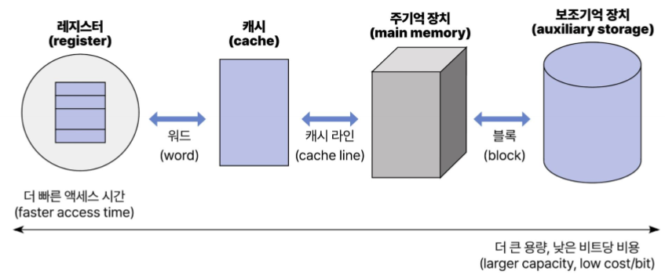
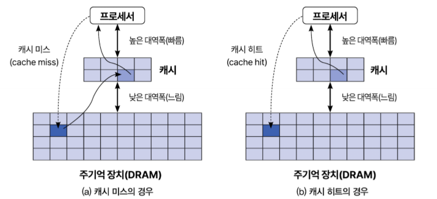

## 1. 메모리 종류

### 1.1. ROM (Read Only Memory)

쓸 수 없고 읽기만 가능한 메모리 ⟶ 쓰기에 제약이 있는 메모리

특징
- 비휘발성(non-volatile): 전원이 꺼졌을 때에도 데이터를 유지
- 소프트웨어 또는 **고정된 데이터를 저장하는 용도**로 사용
- 쓰기 가능 횟수가 한정되어 있음

예시
- **Mask ROM**: 생산할 때 데이터가 고정되어서 출하
- **OTP(One Time Programmable)-ROM**: 한 번만 데이터 쓰기를 할 수 있는 메모리 (보안 측면에서 유용함: 시스템의 암호화 키, 일련번호)
- **EEPROM**: 읽고 쓰는 성능이 가장 떨어짐. 작은 플래시 메모리 정도

### 1.2. RAM (Random Access Memory)

아무 곳이나 읽고 쓸 수 있는 메모리

특징
- 휘발성(volatile): 전원이 꺼지면 데이터를 유지하지 못함
- **수시로 바뀌는 데이터를 저장**하는 용도로 사용 

예시
- **SRAM(Static RAM)**: 트랜지스터 6개로 셀을 구성, 물리적인 크기가 큼, 읽기/쓰기가 빠름
- **DRAM(Dynamic RAM)**: 트랜지스터 1개와 캐퍼시터 1개로 셀을 구성, 저렴함, 전하 방전으로 인한 특정 시간 간격으로 refresh가 필요
- **SDRAM(Synchronous DRAM)**: 클럭 신호에 동기화된 DRAM, 클럭 타이밍에 맞춰서 CPU와 정보 교환
- **DDR SDRAM(Double Data Rate SDRAM)**: SDRAM보다 성능이 두 배 뛰어난 방식
- **NVRAM**: RAM에 배터리를 추가하여 데이터가 보전되도록 만든 메모리

### 1.3. FLASH Memory
비휘발성 메모리인 ROM의 장점과 입출력이 자유로운 RAM의 장점을 동시에 가짐
- **NOR FLASH**: 대용량화 어려움, 읽기 속도 빠름, 쓰기 속도 느림, 데이터 안정성이 우수함
- **NAND FLASH**: 대용량화 가능, 읽기 속도 느림, 쓰기 속도 빠름, 데이터 안정성 낮음

### 1.4. 메모리란?

**데이터를 저장하는 모든 공간**
- 레지스터, 캐시, 주기억 장치, 보조기억 장치로 구분

좁은 의미에서 컴퓨터 시스템의 **'메모리'는 주로 주기억 장치를 지칭함 (RAM)**
- 연산 장치가 접근할 수 있는 가장 먼 저장 장치

**프로그램도 데이터의 일종** ⟶ 프로그램을 실행한다는 것은 프로그램을 메모리에 올리는 것과 같음
- 데이터를 사용하기 위해서는 **반드시 메모리에 해당 데이터가 올라와 있어야 함**

---

## 2. 메모리 계층 구조



### 2.1. 보조기억 장치(auxiliary storage)

데이터를 보관하는 비휘발성 메모리 (HDD, SDD)
- 일반적으로 프로그램, 파일 및 문서의 **장기 보관**을 위해 사용됨
- 컴퓨터가 데이터를 사용하기 위해서는, **보조기억 장치에 있는 데이터를 주기억 장치로** 가지고 와야 함
- 가장 느리지만 가장 저렴하여 용량이 큼

### 2.2. 주기억 장치

연산 장치(예: CPU)가 접근할 수 있는 가장 먼 저장 장치
- 연산을 위한 데이터를 보관하는 공간이며 휘발성 메모리 (RAM: Random Access Memory)

### 2.3. 캐시

자주 사용하는 데이터나 명령어를 **일시적으로 저장**하는 메모리
- CPU와 주기억 장치 사이에 위치하며 주기억 장치보다 빠른 속도로 작동
- **자주 접근하는 데이터에 대한 접근 시간을 빠르게** 하며, 컴퓨터 시스템의 전반적인 성능을 향상

### 2.4. 레지스터

CPU 내부에 위치한 작고 빠른 속도의 저장 영역 
- 현재 CPU에 의해 처리되는 데이터나 명령어를 보유하고 있음
- 산술 및 논리 연산, 데이터 저장, 프로그램 흐름 제어에 사용

### 2.5. CPU와 보조기억 장치에 주기억 장치가 필요한 이유?
문제점
- CPU와 디스크 사이의 속도 차이가 큼
- 데이터 공금 속도가 CPU 활용 효율을 제한하는 원인이 됨 **(I/O bottleneck)**
 
해결책
- 디스크보다 빠른 저장 공간을 중간에 놓아 **프로세서와 디스크 사이의 성능 차이를 메우는 것**
- 메모리 계층: **최소한의 비용으로 최대한의 효과**를 얻기 위한 전략

### 2.6. 캐시가 필요한 이유
CPU가 자주 접근하는 데이터를 **임시로 보관**함으로써 원하는 **데이터에 빠르게 접근**할 수 있도록 도와준다. (캐시의 크기: 수십 KB ~ 수십 MB 수준)

- 데이터에 접근할 때, CPU는 우선 목표 데이터를 포함하는 데이터 블록(data block)이 캐시에 있는지 확인
- 캐시에 해당 데이터 블록이 있는 경우: **"캐시 히트(cache hit)"**
    ⟶ 주기억 장치까지 가지 않고 캐시에 있는 데이터를 사용하여 연산을 수행(이 경우, 데이터 접근 시간을 크게 줄일 수 있음)
- 캐시에 해당 데이터 블록이 없는 경우: **"캐시 미스(cache miss)"**
    ⟶ 주기억 장치에서 해당 데이터 블록을 캐시로 복사한 후(overhead 발생), 캐시에 있는 데이터를 이용하여 연산을 수행



#### 2.6.1. 지역성(Locality)

**공간적 지역성 (Spatial locality)**
- 프로그램이 현재 참조한 메모리 주소와 **인접한 메모리 주소를 다음에 참조**할 가능성이 크다는 특성
- 일반적으로 프로그램은 코드를 순차적으로 수행하는데, 이 때 **배열과 같은 자료구조**를 사용
- 이와 같이 데이터를 '순차적으로' 접근하는 것이 공간적 지역성의 대표적인 예시
- 캐시 히트율을 높이는 특성 

**시간적 지역성 (Temporal locality)**
- 한 번 참조한 메모리 위치를 **곧 다시 참조**할 가능성이 높다는 특성
- 대표적인 예로 반복문(for loop)을 생각할 수 있음
- 동일한 명령어를 여러 번 수행하며, 이는 **동일한 데이터를 반복해서 접근**한다는 의미와 같음
- 대부분의 프로그램이 시간적 지역성을 가지며, 역시 캐시 히트율을 높이는 특성

#### 2.6.2 캐시의 동작 원리가 프로그래밍에 중요한 이유

```c
for (i=0; i<n; i++) {
    for (j=0; j<n; j++) {
        // 1. x = x + (a[j][i]);
        // 2. x = x + (a[i][j]);
    }
}
```

캐시 블록의 크기가 16이며, 캐시는 하나의 캐시 블록만 담을 수 있다고 가정정

**1번 구현의 경우**
- 가장 먼저 접근하는 데이터: a[0][0] ⟶ **캐시 미스** ⟶ 해당 데이터 블록 a[0][0~15]를 캐시로 가져옴
- 다음 접근하는 데이터: a[1][0] ⟶ **캐시 미스** ⟶ a[1][0~15] 블록을 캐시로 가져옴
- 그 다음 데이터: a[2][0] ⟶ **캐시 미스** ⟶ a[2][0~15] 블록을 캐시로 가져옴

**2번 구현의 경우**
- 가장 먼저 접근하는 데이터: a[0][0] ⟶ **캐시 미스** ⟶ 해당 데이터 블록 a[0][0~15]를 캐시로 가져옴
- 다음 접근하는 데이터: a[0][1] ⟶ **캐시 히트**
- 그 다음 데이터: a[0][2] ⟶ **캐시 히트**

2번 구현 ⟶ 데이터에 접근하기 위해 메모리까지 가지 않고도 작업을 할 수 있어서 데이터 접근 시간을 절약할 수 있음

**즉, 알고리즘을 설계할 때 지역성을 높일 수 있는 형태로 작성하는 것이 프로그램의 성능을 높이는 데 도움이 됨**

### 2.7 데이터 전송 단위

두 메모리 계층 사이의 데이터 전송은 보통 일정한 크기로 이루어짐

- 블록(block): 보조기억 장치와 주기억 장치 사이의 데이터 전송 단위. 일반적으로 1~4KB
- 캐시 라인(cache line) 또는 캐시 블록(cache block): 주기억 장치와 캐시 사이의 데이터 전송 단위. 보통 32~128B
- 워드(word): 캐시와 레지스터 사이의 데이터 전송 단위. 보통 16~64bit

---

## 3. 물리 주소와 논리 주소

